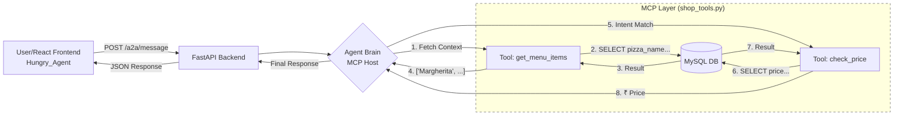

# 🍕 Pizza Man - AI-Powered Pizza Agent

**Pizza Man** is a full-stack AI agent application designed to handle customer enquiries for a pizza shop. Unlike standard ordering forms, it uses an intelligent agent architecture to understand user intent ("What is the price of...") and dynamically fetches real-time data from a MySQL database.


## 🏗️ Architecture & Workflow

1.  **Frontend (React):** Captures user natural language (e.g., "Price of Pepperoni?").
2.  **API Layer (FastAPI):** Receives the message via a POST request.
3.  **The Brain (Agent):**  Dynamically fetches the current menu from the Database to understand valid items and detects intent (e.g., specific pizza inquiry).
4.  **Tools Layer:** Connects to MySQL to execute specific queries (Price check).
5.  **Database (MySQL):** Stores the source-of-truth for the menu and prices.



## Install dependencies:
```pip install fastapi uvicorn mysql-connector-python python-dotenv```

## Create .env file:
```
DB_HOST=localhost
DB_USER=root
DB_PASSWORD=your_password_here
DB_NAME=pizzashop
```

## Frontend Configuration: 
```
npm install
# Ensure you are in the frontend directory
npm start
# OR if using Vite
npm run dev
```

## Backend Configuration: 
```
# Ensure you are in the backend directory
python shop_agent.py
# Output: 🟢 Shop Agent is ONLINE on Port 8000

```
